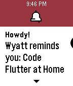

# Wyatt

A location- and time-based reminder app for Android and iOS.


*W*hen *Y*ou *A*re *T*here, *T*hen ...

---

Wyatt helps you to remember things like:

- You know of a road closure scheduled between 9pm and 5am, and you want to make sure to take the detour when you're getting closer (leaving earlier is a different case).
- When you're back in your home town, reconnect with friends.
- As soon as you're near your favorite ice cream place, don't forget to grab some for the family.

---

Here's how Wyatt looks like:


Screenshots can be found [here](device_screens/screenshots/APP.md).

## Documentation

- [Backlog](docs/BACKLOG.md)
- [Bookmarks](docs/BOOKMARKS.md)
- [Development](docs/DEV.md)
- [FAQ](docs/FAQ.md)
- [How-to](docs/HOWTO.md)
- [Ideas](docs/IDEAS.md) (partially outdated, archivable)
- [Lessons learned](docs/LESSONS_LEARNED.md)
- [Logging](docs/LOG.md)
- [Styleguide](docs/STYLEGUIDE.md)
- [To-do](docs/TODO.md)

Please also see the accompanying webpage: [wyatt.lttl.dev](https://wyatt.lttl.dev)

## Tips / Known Limitations / Known Issues

- If you plan to be notified for a bigger place, like a mall, give it a good radius. Not a good example is a distance of 100 m from the center of the mall as this probably doesn't trigger a notification around the mall.
- There should be a minimum of ~2h for a notification start and end date/time window, esp. when traveling. This is due to the (OS given) 15 minutes interval between background activities ([Background service](https://pub.dev/packages/flutter_background_service): *iOS... cannot be faster than 15 minutes and only alive about 15-30 seconds.*)
- [This warning](https://github.com/fluttercommunity/flutter_workmanager/blob/main/IOS_SETUP.md#enable-bgtaskscheduler) outlines scheduling limitations (on iOS).
- Reliable determination of a location only seems to work on physical devices that are online and connected to the cell phone network, i.e., with a cell phone plan which includes data; a hot-spotted Wifi connection is not enough (as tested in the field) - **If you see limited connectivity from cell phone provider as in [this screenshot](device_screens/screenshots/no-notifications.png), you will not get notified at all even when you should be!**
- With a limited Wi-Fi connection, notification is delayed!
- Only portrait mode is supported for the time being.
- Android only: With the Nova Launcher, the app icon doesn't show the white (circular) background as intended (and as it does with the default launcher), but a dark-greyish one.

## Known Bugs

- Reordering of reminders is not yet persistent.
- "Reset" on "Add Reminder" / "Edit Reminder" doesn't reset locaton and date fields.
- The buttons in the permissions hint dialog ("Let's get started") are (strictly speaking) swapped - as per [Styleguide](docs/STYLEGUIDE.md) the affirmative button should be on the left while in this confirmation it is on the right. This is due to the used [3rd party package](https://pub.dev/packages/confirm_dialog) and would require an implementation change.

## Repo Structure

```
.
├── .vscode        # Wyatt: app launch configs
├── android        # Flutter
├── assets         # Wyatt: app icons and images
├── device_screens # Wyatt: app screenshots and screenrecording
├── docs           # Wyatt: documentation incl. images
├── ios            # Flutter
├── lib            # Flutter
├── logcat         # Wyatt: for logcat-specific logging
├── lttl.dev       # Wyatt: app supporting web page 
└── test           # Flutter
```

## Get Started

[Here's why](docs/FAQ.md), at least at this point, Wyatt is not available from an app store. 

Long story short, in a nutshell, you would need
- to [get a Google Maps API key](https://wyatt.lttl.dev#key),
- to build the app yourself,
- to upload the built app to your device.

To do that, I use either my 2023 Mac mini M2 (8 GB) or my 2020 MacBook Pro M1 (16 GB), both on the latest OS version at the time of writing.

### On Android

- [Enable Developer options](https://developer.android.com/studio/debug/dev-options#enable).
- [Enable USB debugging](https://developer.android.com/studio/debug/dev-options#Enable-debugging).
- Plug in your (Pixel) device to your computer, and accept access.
- Run `make all-android` (ignoring the warnings).
- Start the Wyatt app on the device.

### On iOS

**Important: You need an Apple developer identity with your own "development team" set up in Xcode to sign for iOS device deployment.**

- Plug in your iPhone to your Mac.
- Run `make all-ios`.
- Trust the developer: "Tap Settings > General > VPN & Device Management. In the ~~Enterprise~~Developer App section, tap the name of the app developer. Tap Trust '[developer name]' to continue." (derived from [this](https://support.apple.com/en-us/118254) source)
- Start the Wyatt app on the device.

## Wireframe

The mockup is [here](docs/wireframe.pdf).

## [Lessons Learned](docs/LESSONS_LEARNED.md)

## License

This project is licensed under the GNU General Public License v3.0 (GPL-3.0) or later. See the [LICENSE](./LICENSE) file for details.

## Misc.

To check connectivity, the "Default Uris" listed [here](https://github.com/OutdatedGuy/internet_connection_checker_plus?tab=readme-ov-file#default-uris) are pinged. That's due to [this](https://pub.dev/packages/internet_connection_checker_plus) 3rd party package implementation, and where e.g. connections to https://one.one.one.one come from.

## Acknowledgements

- [Max Schwarzmüller](https://github.com/maxschwarzmueller) for his incredible [Flutter & Dart - The Complete Guide [2024 Edition]](https://www.udemy.com/course/learn-flutter-dart-to-build-ios-android-apps/)
- Copilot for the Wyatt logo and the AppBar background
- Google for Maps and font(s)
- [Moqups](https://app.moqups.com) for the [wireframe](https://github.com/m5lk3n/wyatt?tab=readme-ov-file#wireframe)
- [zeshuaro](https://github.com/zeshuaro) for [Appainter](https://appainter.dev/)

### [wyatt.lttl.dev](https://wyatt.lttl.dev)

- [HTML5 UP](https://html5up.net/) for [Strongly Typed](https://html5up.net/strongly-typed)
- [Font Awesome](https://fontawesome.com/) for icons and font
---
<p align="center">
    
</p>

---
<p align="center">
    <a href="https://lttl.dev/"></a>
</p>