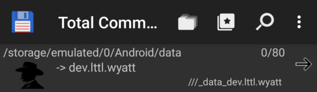
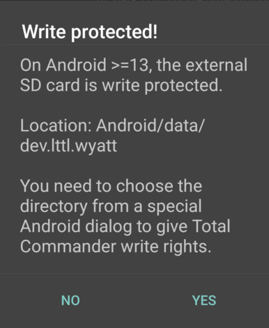
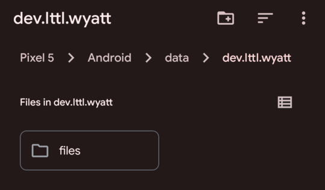
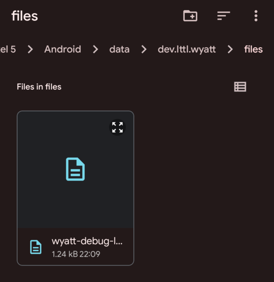

# Logging

**This is Android-only!**

## Application logs

In order to capture app logs in a file on the physical device when putting Wyatt to test in the field, I implemented a `tee`-like approach with log-levels as follows:

- In debug mode, log everything to `/storage/emulated/0/Android/data/dev.lttl.wyatt/files/wyatt-debug-log.txt` by *appending* to the file.

- In release mode, log only errors and "release"/"prod" messages to `/storage/emulated/0/Android/data/dev.lttl.wyatt/files/wyatt-release-log.txt` by overwriting this file every time Wyatt is started.

The implementation details can be found [here](https://github.com/m5lk3n/wyatt/blob/main/lib/log.dart#L27-L46).

(Additionally, to integrate with Flutter DevTools in my IDE, I keep on supporting the usual `log` route in development/debug.)

In order to access this file, I use the [Total Commander for Android](https://www.ghisler.com/android.htm) app. These are the steps:

1. Open Total Commander, navigate to `/storage/emulated/0/Android/data`, find and press the `dev.lttl.wyatt` entry:

2. Say "YES" here:

3. Tap on the "files" folder entry:

4. "Expand" the file:

## Process-level logs

To pull process-level logs from the device, there's [logcat](../logcat/logcat.sh).